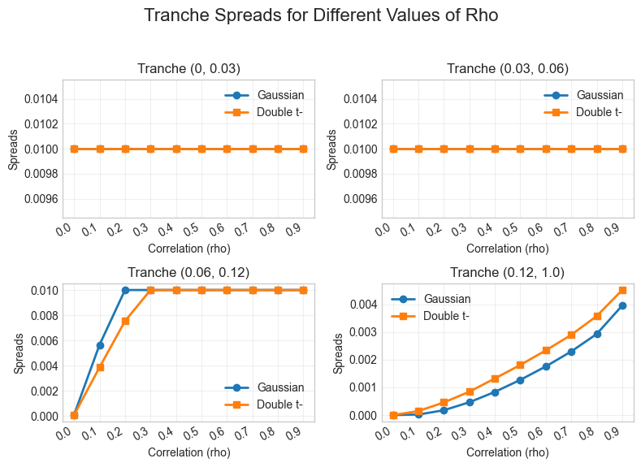

# CDO Pricing: Gaussian vs. Double $t$ Copula
Python implementation of CDO tranche pricing under the one-factor Gaussian
copula and the double $t$ copula, developed for my MSc thesis at Copenhagen
Business School (grade 12/A). Full thesis: [CDO Thesis.pdf](CDO%20Thesis.pdf).
The thesis used proprietary data from a Bloomberg Terminal, and can therefore not be shared.

## Results

This plot shows the upper and lower tail dependence of the Gaussian copula and the double $t$ copula for $\rho =0.5$. The axes show the extreme quantiles of the $[0,1]$ variables. For each copula, 10,000,000 samples were generated.

This plot shows the probability distribution of the number of defaults for both the Gaussian copula model and the double $t$ copula model for different values of $\rho$ at maturity $T=5$. It also indicates the number of defaults needed for each tranche to be wiped out.

This plot shows the fair tranche upfronts for different values of $\rho$ for both the Gaussian copula model and the double $t$ copula model.

This plot shows the fair tranche spreads for different values of $\rho$ for both the Gaussian copula model and the double $t$ copula model.

This plot shows the compound correlation calculated for different tranches using a Gaussian copula model and a double $t$ copula model for iTraxx S42 5Y tranches on June 20, 2025.

## Key Findings
 - Range of compound correlation was 0.48 for $t$ copula compared to 0.76 for Gaussian copula across tranches, implying a better fit of the $t$ copula.
 - Changing the underlying assumption of the systematic and idiosyncratic factors shifts the probability mass towards the tails because of tail dependence. This causes higher probability of both very few (but non-zero) and very many defaults. The higher probability makes the equity and senior tranches more risky in the $t$ copula leading to higher fair spreads/upfronts.

## Gaussian Copula Model
CDO pricing model following homogeneous Gaussian copula logic and Gauss-Hermite integration. Separates the payment legs into three parts: Expected Tranche Principal, Expected Regular Spread Payments, Expected Accrual Payments. 
Given an upfront, spread, and lower and upper tranche bounds, the model can find the compound correlations and base correlations for tranches.
The model can also find upfront and spread for a given compound correlation and lower and upper tranche bounds.
Portfolio size, recovery rate, and integration points for Gauss-Hermite can all be modified when initializing the class.

## $t$ Copula Model
Expansion of the Gaussian Copula, where the systematic and idiosyncratic factors are instead $t$ distributed with $\nu$ degrees of freedom.
This necessitates the use of characteristic functions and adaptive quadrature to integrate over the systematic factors.
Possesses the same capabilities as the Gaussian copula; only the underlying assumption and the integration engine differ.

## Limitations
Both models are hardcoded to market data format: 
 - Maturities are fixed at 5 years.
 - CDS spread delta is fixed at 1/2 year.
 - CDO spread delta is fixed at 1/4 year.
 - ZCB prices with maturities from (0,5] years with 8 rates per year were used.
 - CDO tranche spreads and upfronts of iTraxx Europe Index S42 were used.
 - CDS Index spreads of iTraxx Europe Index S33-S42 were used to estimate implied cumulative default probabilities.

## Requirements
Python 3 with NumPy, SciPy, pandas, matplotlib, math and jupyter.
(Python 3.11.2 was used)
