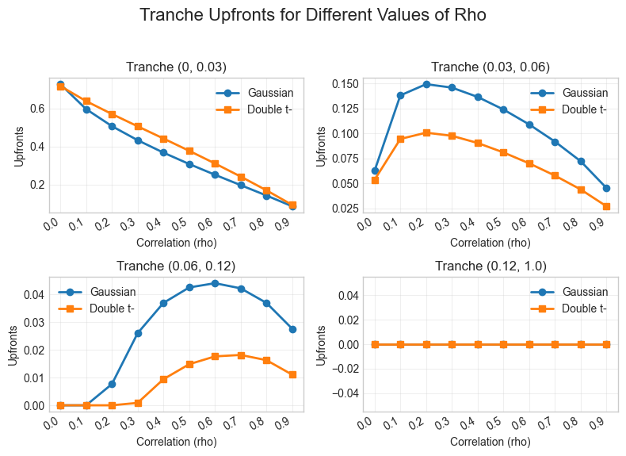
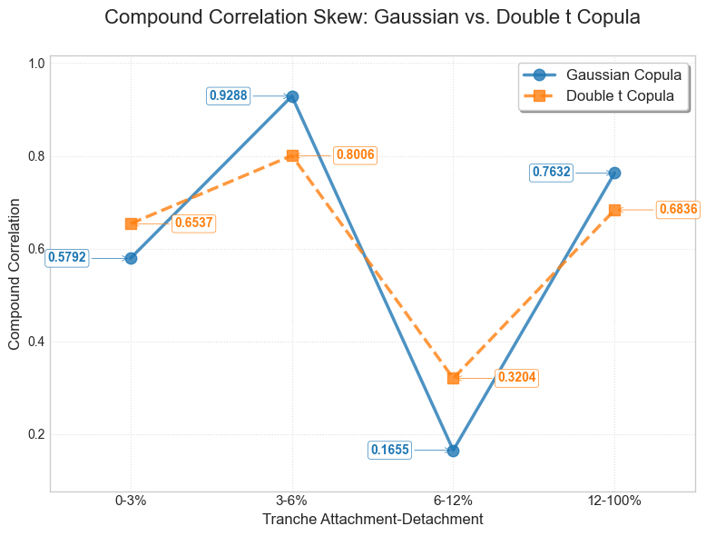

# CDO Pricing: Gaussian vs. Double t Copula
Python implementation of CDO tranche pricing under the one-factor Gaussian
copula and the double t copula, developed for my MSc thesis at Copenhagen
Business School (grade 12/A). Full thesis: [CDO Thesis.pdf](CDO%20Thesis.pdf)

# Results

# Key Findings
Range of compound correlation was 0.48 for t-copula compared to 0.76 for Gaussian copula.
Changing the underlying assumption of the systematic and idiosyncratic factors shifts the probability mass towards the tails, increasing the probability of high and low amounts of defaults. This makes the equity and senior tranches more risky in the t-copula leading to higher fair spreads.

# Gaussian Copula Model:
CDO pricing model following homogeneous Gaussian copula logic and Gauss-Hermite integration. Separates the payment legs into three parts: Expected Tranche Principal, Expected Regular Spread Payments, Expected Accrual Payments. 
Given an upfront, spread, and lower and upper tranche bounds, the model can find the compound correlations and base correlations for tranches.
The model can also find upfront and spread for a given compound correlation and lower and upper tranche bounds.
Portfolio size, recovery rate, and integration points for Gauss-Hermite can all be modified when initializing the class.

# t-Copula Model:
Expansion of the Gaussian Copula, where the systematic and idiosyncratic factors are instead t-distributed with v degrees of freedom.
This necessitates the use of characteristic functions and adaptive quadrature to integrate over the systematic factors.
Possesses the same capabilities as the Gaussian Copula, only the underlying assumption is altered and the engine to generate results

# Limitations
Both models are hardcoded to market data format
